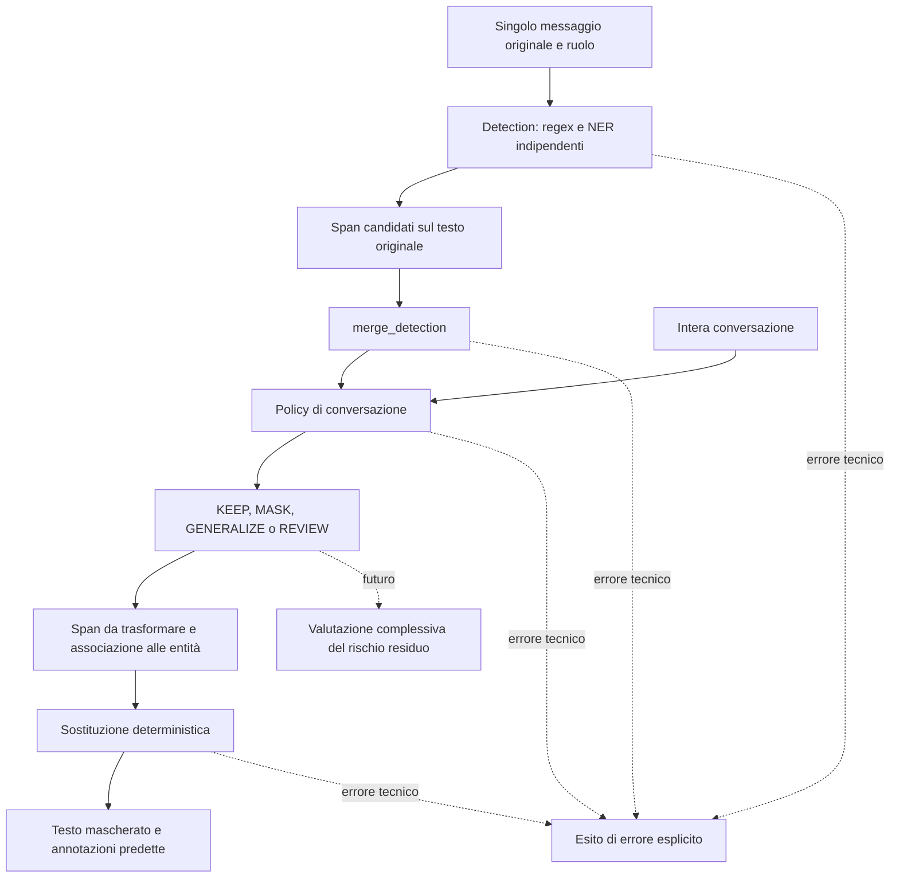
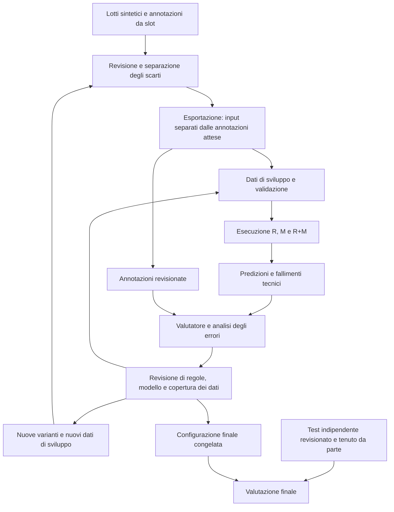

# Metodologia di ricerca per il masking contestuale

Stato: proposta iniziale, 28 settembre 2026. Questo documento definisce gli
esperimenti da implementare; non descrive un sistema di masking già disponibile.

## Obiettivo e perimetro

Individuare e sostituire le porzioni identificative nelle conversazioni del
punto unico di contatto Istat, conservando le informazioni utili alla richiesta.
Riconoscere un nome o un luogo non basta: occorre decidere quale funzione abbia
nel contesto. Le decisioni già concordate sono in `casi_ambigui_masking.md`.
Il masking non costituisce, da solo, una garanzia di anonimizzazione complessiva.

Prima versione: PERSON, ADDRESS, EMAIL, PHONE, COD_UTENTE, PASSWORD e NUM_PRATICA.
Altre categorie, presenti nel prototipo storico, saranno introdotte solo con
regole di annotazione, esempi e valutazioni dedicati. Non dichiarare copertura
di codice fiscale, partita IVA, organizzazioni o altre categorie non valutate.

Esempi: un indirizzo personale va mascherato; il comune oggetto di una ricerca
statistica va conservato. Un codice utente va mascherato; un codice PSN pubblico
va conservato. Nomi bibliografici e contatti pubblici seguono le decisioni
contestuali concordate, non un'esclusione generale basata sul solo valore.

## Input e output

Il riconoscimento opera sul singolo messaggio originale, elaborando sia utente
sia chatbot. La policy riceve invece la conversazione completa e le detection
già combinate da `merge_detection`. Dichiarare e misurare l'eventuale limite di contesto della
policy; non troncare silenziosamente i messaggi.

Il componente di riconoscimento riceve solo testi e ruoli. Scheda di generazione, slot, valori
campionati, trattamento atteso e riepilogo finale non sono input del modello.
Il riepilogo, se va mascherato come documento, richiede una valutazione separata.

Output: lista di span con campo, start incluso, end escluso, tipo, provenienza
del componente di riconoscimento e, dove disponibile, score. Le posizioni si riferiscono ai
caratteri Unicode del testo originale, coerentemente con le annotazioni locali.
La conversione token/caratteri deve essere verificata, anche con accenti e apostrofi.

## Architettura minima

**La soluzione di ricerca proposta è ibrida: il riconoscimento combina regular
expression e una componente modellistica. Non si prevede di riconoscere tutte
le categorie, e in particolare gli indirizzi, attraverso sole regex.**

I due canali leggono il testo originale in modo indipendente. Il modello non
riceve soltanto i candidati trovati dalle regex: può individuare uno span anche
quando nessuna regola produce una corrispondenza. Le regex non sono quindi un
filtro preliminare obbligatorio. I risultati vengono successivamente combinati.

| Canale | Contributo previsto | Limite da valutare |
|---|---|---|
| Regex e regole contestuali | Formati riconoscibili: email, alcune forme di telefono e identificativi; indizi lessicali locali | Il formato non determina da solo la funzione personale o pubblica del valore; varianti non previste possono sfuggire |
| Modello NER | Individuazione di span, inclusi nomi e indirizzi variabili, nel singolo messaggio | Richiede dati appropriati e valutazione; può omettere entità o sbagliare confini e tipi |
| `merge_detection` | Integrare le detection e rendere espliciti accordi, disaccordi e sovrapposizioni | Nessuna priorità automatica universale delle regex sul modello: i conflitti restano osservabili |

Le categorie non sono assegnate in modo esclusivo a un canale: il modello può
riconoscere anche un telefono, e una regola può fornire un indizio su un indirizzo.
L'obiettivo degli esperimenti è misurare il contributo dei due canali, non
presupporre che la loro combinazione sia sempre migliore.

1. Regex e modello leggono il testo originale e producono span candidati.
2. `merge_detection` combina i risultati senza eliminare disaccordi o
   sovrapposizioni semanticamente diversi.
3. La policy, a livello di conversazione, distingue dati personali e riferimenti
   da conservare o generalizzare e gestisce i conflitti.
   Non assumere che ogni numero lungo sia telefono o partita IVA, né ogni data
   sia personale. Non trattare lo score del modello come probabilità calibrata.
4. La sostituzione deterministica applica gli span senza riscrivere altro testo.
   Gli identificativi, per esempio PERSON_1, restano coerenti nella conversazione
   e ripartono nella conversazione successiva. L'identità di due occorrenze non
   va dedotta da una semplice uguaglianza testuale in contesti incompatibili.

Nessun servizio separato necessario: poche funzioni con un formato comune.
Errori tecnici del componente di riconoscimento devono essere espliciti, non convertiti in esiti riusciti
con testo parzialmente mascherato. Conservare gli originali per la ricerca.

### Esempio: riconoscimento e masking degli indirizzi

Un indirizzo non ha un unico formato rigido. Il modello dovrà essere valutato
su espressioni quali «via Garibaldi 12, Roma», «v. Garibaldi, civico dodici» e
«piazza dell’Unità, senza numero», oltre che su refusi e informazioni distribuite
fra turni. Le regex possono contribuire con indizi, ma non costituiscono una
soluzione sufficiente per questa categoria.

Occorre inoltre distinguere la forma dell'espressione dalla sua funzione:

| Contesto | Decisione attesa |
|---|---|
| «Abito in via Garibaldi 12, Roma» | Mascherare «via Garibaldi 12, Roma» come ADDRESS |
| «Vorrei riceverlo a casa», seguito da «Via Garibaldi 12, Roma» | Usare il turno precedente per riconoscere il recapito personale nel messaggio corrente |
| «Cerco dati sui residenti di via Garibaldi» | Conservare il riferimento stradale quando è chiaramente oggetto della ricerca, senza funzione identificativa personale |

La revisione 5.0 non addestra il detector a predire direttamente gli span da
mascherare. Detection e decisione contestuale hanno contratti e valutazioni
separati. La policy potrà essere implementata con regole, un LLM o una soluzione
ibrida senza cambiare il formato prodotto dai detector.

Il dataset dovrà includere coppie contrastive e varianti di forma, non soltanto
nuovi nomi di strade inseriti nella stessa frase. Lo stradario compatto oggi
serve alla generazione: non è un elenco esaustivo per decidere cosa mascherare.
Una strada assente dallo stradario può essere un indirizzo personale; una strada
presente può essere un riferimento pubblico da conservare. La generalizzazione
a nomi e forme non visti deve essere misurata esplicitamente.

## Terminologia

Usiamo **componente di riconoscimento** per il software che individua gli span
candidati: può applicare regole, un modello o entrambi. Il termine «rilevatore»
è riservato ai colleghi che svolgono le indagini sul campo.

Il **componente di decisione** stabilisce quali candidati mascherare nel contesto
e risolve i conflitti. Il **componente di sostituzione** applica le etichette al
testo. Il **valutatore** confronta le predizioni con le annotazioni revisionate.
Sono responsabilità logiche e interfacce separate. Un esperimento futuro potrà
usare lo stesso modello internamente, ma dovrà continuare a esporre e valutare
separatamente detection e decisioni.

## Workflow di elaborazione di una conversazione

Il ramo tratteggiato rappresenta lo step 3, non ancora implementato. La policy
corrente usa la conversazione completa per decidere ciascuna detection, ma non
restituisce un giudizio aggregato sul rischio residuo.

1. Validare testo e ruolo, associando ID di conversazione e messaggio solo per
   tracciabilità.
2. Riconoscere candidati in ciascun messaggio indipendentemente.
   Regex e NER lavorano sullo stesso testo originale, non sul testo già
   sostituito dall'altro componente.
3. Combinare le detection, quindi sottoporre conversazione e detection alla
   policy versionata. Le detection sovrapposte o discordanti restano esplicite;
   la policy può produrre KEEP, MASK, GENERALIZE o REVIEW.
4. Associare le occorrenze alle entità della conversazione e assegnare etichette
   coerenti, per esempio PERSON_1 e PERSON_2. Inizialmente usare corrispondenze
   conservative; alias e coreferenze ambigue richiedono valutazione dedicata.
5. Sostituire gli span senza alterare il testo esterno e restituire testo
   mascherato, annotazioni e stato dell'elaborazione. Aggiornare lo stato della
   conversazione soltanto dopo un'elaborazione riuscita.

Nella ricerca, la policy vede la conversazione originale completa e le detection;
le ipotesi attese non fanno parte del suo input. Un futuro esperimento online a
contesto incrementale dovrà avere un protocollo separato. Per ogni esperimento
azzerare lo stato tra conversazioni e mantenerlo separato fra sistemi confrontati.

Un esito riuscito con zero span è diverso da un errore tecnico. Nel secondo caso
non presentare il testo come correttamente mascherato; registrare il fallimento
separatamente dalle omissioni di previsione. Il comportamento operativo in caso
di errore sarà definito prima dell'integrazione nel servizio.

Esempio: «Cerco dati su Roma; abito in Via Verdi 12, Milano». La decisione
conserva Roma come oggetto della ricerca e maschera l'indirizzo personale;
la sostituzione produce «Cerco dati su Roma; abito in [ADDRESS_1]».

## Workflow della ricerca

I lotti già esaminati alimentano lo sviluppo. Prima di generare il dataset più
ampio si riservano famiglie di varianti per validazione e test. Le annotazioni
attese sono accessibili al valutatore; quelle di training sono usate come target
di addestramento, mai come parte dell'input testuale del modello. Gli errori sul
test finale non guidano una nuova ottimizzazione mantenendo lo stesso test come
indipendente: in quel caso occorre un nuovo insieme finale.

Primo incremento concreto: esportatore, piccolo insieme revisionato, valutatore,
baseline a regole e sostituzione. Successivamente ampliare i dati e introdurre
il modello, mantenendo input, output e metriche comuni. Nessuno dei due diagrammi
implica che questi componenti siano già implementati.

## Esperimenti

La baseline a sole regole è un riferimento sperimentale e un primo incremento
implementativo, **non l'architettura finale proposta né una promessa di copertura
degli indirizzi**. La componente modellistica fa parte del percorso previsto.

- R: baseline a regole, con formati e contesto locale espliciti.
- M: encoder preaddestrato a pesi aperti, adattato al riconoscimento degli
  elementi presenti nel testo indipendentemente dalla decisione di policy.
- R+M: combinazione, sullo stesso test, per misurare il contributo delle regole.

Il vecchio modello di Samantha è un eventuale riferimento storico, non un
vincolo. Un modello generativo a pesi aperti è un confronto successivo, non
una dipendenza della prima versione. Nessun checkpoint è ancora selezionato:
verificare italiano, licenza, contesto, costo operativo e disponibilità dei pesi.
Ambiente di ricerca: A100 su Azure, presumibilmente 80 GB, da verificare.
Obiettivo successivo: esecuzione su infrastruttura Istat, con misure di memoria
e latenza anche sull'hardware effettivamente destinato al servizio.

## Dataset e separazione degli esperimenti

I lotti attuali sono materiale di sviluppo. Sono già stati letti e usati per
modificare i prompt: non sono un test finale indipendente. Lo stato `valido`
indica controlli automatici, non approvazione semantica delle annotazioni.

Conservare originali e revisioni separati. Escludere dal benchmark revisionato
gli scarti non risolti; registrare correzioni, autore della revisione e versione.
Controllare anche dati introdotti fuori dagli slot e falsi negativi nelle
conversazioni dichiarate senza dati personali.

Obiettivo iniziale indicativo: circa 1.000 conversazioni, dopo aver ampliato
le situazioni. Non è una soglia di sufficienza per il fine-tuning. Preparare
prima la separazione sviluppo/validazione/test, per famiglie di varianti e
conversazioni intere; mantenere insieme derivazioni e quasi duplicati. Seed
diversi, da soli, non garantiscono indipendenza. Il test finale deve usare
varianti nuove e non guidare successive modifiche senza essere riclassificato
come sviluppo. Registrare manifest, versioni e hash dei file.

Ampliare con negativi difficili, coppie contrastive (stessa forma, funzione
diversa), formati non visti, refusi, riferimenti tra turni, dati spontanei e
ripetizioni del chatbot. Misurare la copertura di queste caratteristiche.
Non confondere la distribuzione mirata con quella del traffico reale.
Un'eventuale valutazione su dati reali revisionati sarà una fase distinta,
necessaria prima di concludere sulla generalizzazione al servizio.

## Metriche e revisione

- Precision, recall e F1 sugli span esatti e sul tipo, globali e per categoria.
- Recall della copertura dei caratteri sensibili e caratteri conservabili
  rimossi erroneamente: rendono visibili errori parziali nei confini.
- Quota di conversazioni con almeno un dato personale non coperto.
- Falsi positivi sui negativi difficili e sui riferimenti pubblici.
- Coerenza delle sostituzioni fra turni e casi di identità erroneamente unite.
- Latenza, memoria e fallimenti operativi, con hardware e configurazione.

Riportare conteggi, denominatori, distinzione utente/chatbot e risultati per
scenario. Non chiamare il tasso di validazione del generatore accuratezza del
masking. Soglie e priorità fra omissioni e mascheramento eccessivo si concordano
sulla validazione, non sul test finale. Affiancare alle metriche una revisione
degli errori; ove possibile far annotare indipendentemente un sottoinsieme
e risolvere i disaccordi esplicitamente.

## Sequenza di implementazione

1. Esportazione senza informazioni sulle risposte attese nell'input, piccolo
   insieme revisionato e valutatore indipendente dal modello.
2. Baseline regex e sostituzione deterministica con test locali.
3. Catalogo ampliato, split e generazione a lotti eseguita dall'utente.
4. Selezione documentata del modello, fine-tuning ed esperimenti R/M/R+M.
5. Analisi degli errori e verifica operativa su infrastruttura Istat.

Non avviare download, generazioni o training come effetto della sola lettura
della configurazione. Credenziali fuori dai file versionati.

## Perimetro della revisione 5.0

Il livello messaggio esegue detection tecnica sul testo originale. Il livello
conversazione assegna `KEEP`, `MASK`, `GENERALIZE` o `REVIEW` a ciascuna
detection usando tutti i turni come contesto. Un terzo step, non ancora
implementato, valuterà complessivamente il rischio residuo della conversazione
dopo le decisioni puntuali. Dati sanitari e valutazione del rischio a livello
dell'intero dataset restano fuori dal perimetro corrente e dalle metriche.
