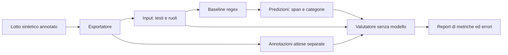

# Pipeline operativa

I comandi vanno eseguiti dalla root della repository, non dalla cartella docs.
La prima parte descrive esportazione, baseline e valutazione del masking;
la seconda conserva istruzioni di generazione e note delle versioni precedenti.
Le note storiche non rappresentano lo stato corrente dei prompt.

## Pipeline di masking: stato attuale

Sono implementati esportazione del dataset, baseline regex e valutatore.
La componente modellistica, la combinazione contestuale e la sostituzione delle
predizioni con etichette coerenti sono i passi successivi. Le annotazioni da
slot del generatore sono il riferimento atteso, non predizioni di un sistema.



I tre step seguenti sono locali: non richiedono API, credenziali o GPU.
Eseguire dalla root del progetto, un passo alla volta. I percorsi mostrati
corrispondono all'esperimento già eseguito: per ripeterlo scegliere output nuovi,
aggiornando anche i comandi successivi. Gli script rifiutano sovrascritture.
Occorre avere il lotto sorgente localmente: `output/` non è versionata.

### 1. Esportare input e annotazioni

```sh
.venv/bin/python src/esporta_dataset_masking.py \
  --input output/lotto_openai_mirato_v4_4/chat_lotto.jsonl \
  --output output/dataset_masking_v4_4
```

`--input` è ripetibile per più lotti. L'esportatore mantiene ordine, testi e
ruoli, verifica gli span del dialogo ed esclude record non validi. Produce:

| File | Contenuto |
|---|---|
| `input.jsonl` | ID tecnico e conversazione con testi e ruoli, senza schede o gold |
| `annotazioni_attese.jsonl` | Span del dialogo, categorie e identità attese |
| `provenienza.jsonl` | Origine e stato della revisione qualitativa per record |
| `esclusi.jsonl` | Record esclusi e motivazioni |
| `manifest.json` | Hash delle fonti, conteggi e categorie |

Gli ID combinano hash del lotto e ID originale. Non sono feature da dare al
modello. Le annotazioni di riepiloghi e spiegazioni restano fuori da questa
valutazione. `--revisione FILE` consente di associare le segnalazioni qualitative
esistenti tramite hash della fonte; i record validi ma segnalati restano esportati
con tale stato. `valido` non equivale a revisione umana: i record senza
segnalazioni restano `non_revisionato`, non automaticamente approvati.
Per il futuro modello usare soltanto il messaggio corrente e i turni precedenti,
non il resto della conversazione, pur presente nel file esportato.

### 2. Produrre le predizioni regex

```sh
.venv/bin/python src/predici_regex.py \
  --input output/dataset_masking_v4_4/input.jsonl \
  --output output/predizioni_regex_v1_v4_4
```

Produce `predizioni.jsonl` e `manifest.json`. Legge solo gli input, senza gold,
e non modifica i testi. Le regole sono in `config/regole_masking.json`, distinto
da `config/regole_generazione.json`; sono selezionabili con `--regole FILE`.

Copertura iniziale: email, alcune forme di cellulari italiani, codici utente,
password esplicite e numeri di pratica contestuali. Non riconosce PERSON o
ADDRESS e non propaga le entità tra turni. Elabora sia utente sia chatbot.
Un esito `ok` significa esecuzione riuscita, non previsione corretta.
Dettagli e limiti: [baseline regex](baseline_regex.md).

### 3. Valutare le predizioni

```sh
.venv/bin/python src/valuta_masking.py \
  --input output/dataset_masking_v4_4/input.jsonl \
  --attese output/dataset_masking_v4_4/annotazioni_attese.jsonl \
  --predizioni output/predizioni_regex_v1_v4_4/predizioni.jsonl \
  --output output/predizioni_regex_v1_v4_4/valutazione.json
```

Il valutatore non usa un modello: confronta gli span predetti con quelli attesi.
Calcola precision, recall e F1 esatti (confini e tipo), risultati per categoria
e ruolo, copertura dei caratteri sensibili e falsi positivi sui negativi.
Riporta separatamente errori tecnici e predizioni mancanti: le metriche sono
calcolate sui soli esiti `ok`. Denominatori nulli producono `null`.
Non valuta ancora identità coerenti, testo sostituito, latenza o memoria.
Formato delle predizioni: [valutatore](valutatore_masking.md).

### Risultato iniziale e significato

Sul lotto 4.4: 24 conversazioni esportate, 46 span attesi nei dialoghi;
23 annotazioni fuori dal dialogo omesse. La baseline regex v1 ha ottenuto:

| Misura | Risultato |
|---|---:|
| Span corretti / attesi | 27 / 46 |
| Falsi positivi / omissioni | 0 / 19 |
| Precision / recall / F1 | 100% / 58,7% / 74,0% |
| Conversazioni con omissioni / con dati attesi | 8 / 12 |
| Fallimenti tecnici | 0 |

Sono risultati di sviluppo su dati sintetici non ancora approvati come gold:
non dimostrano assenza di falsi positivi in generale. Nomi e indirizzi spiegano
10 delle 19 omissioni; le altre riguardano codici, password e pratica.
Conservare questa baseline per il confronto successivo con il modello.

### Verifiche locali

```sh
.venv/bin/python -m unittest discover -s tests -v
```

`tests/test_valuta_masking.py` è anche eseguibile da solo: usa esempi artificiali
con errori intenzionali per verificare i calcoli, non misura le prestazioni del
sistema sul dataset. La metodologia completa è in
[metodologia del masking](metodologia_masking.md).

## Generazione sintetica: funzionalità introdotte nella versione 4.0

- Cinque input locali; unico stradario letto: `data/strade_lazio.csv`.
- Catalogo PSN con tipo di rispondente e fonte della classificazione.
- Sei casi pilota collegati agli ID della specifica; associazioni PSN esplicite.
- Nuovi metadati senza `canale`; chiave portale a null, separata dal codice PSN.
- Etichette attive: PERSON, EMAIL, ADDRESS, COD_UTENTE, PASSWORD, NUM_PRATICA, PHONE.
- Span esatti per messaggi utente, chatbot, descrizione ed eventuali ripetizioni
  nelle spiegazioni del trattamento. La risposta originale resta conservata.
- I lotti storici restano rivalidabili con il loro formato originale.

Questo incremento non completa la specifica: restano i generatori CF, PIVA e ORG,
il formato COD_UNITA da concordare, l’estensione progressiva ai 55 scenari,
le quote linguistiche e gli split di training/development/test, la ripresa dei
lotti e una revisione semantica più ampia. Lo split dei nuovi prompt è `pilota`.

## Modificare le regole

| File | Contenuto modificabile |
|---|---|
| `config/regole_generazione.json` | Prefissi e lunghezze dei codici utente, formato delle pratiche, password e telefoni. |
| `config/scenari.json` | Situazioni, entità ammesse, indagini compatibili, istruzioni generiche di risposta. |
| `data/codici_psn.csv` | Coppie codice–nome, classificazione e fonti. |

Il formato pratica è provvisorio: cifre + `/` + anno a due cifre. `Prot.n.` resta
fuori dal valore e dallo span. COD_UNITA è dichiarato in attesa di formato:
il generatore restituisce un errore se gli viene richiesto.
Le regole JSON sono salvate anche nel lotto dei prompt. I valori sono sintetici;
non rappresentano credenziali effettive né recapiti verificati.

## Preparare i prompt senza API

Richiede Python 3.10+, senza dipendenze esterne:

```sh
python3 src/parse_input.py
python3 src/genera_prompt.py --seed 0 --output output/prompts_v4.jsonl
python3 -m unittest discover -s tests -v
```

Il percorso `output/prompts_v4.jsonl` è un esempio storico: il generatore usa
la versione corrente del prompt, indipendentemente dal nome del file. Per
ricreare schede scegliere un nuovo percorso di output. Non contengono risposte
del modello.

Il default prepara 24 prompt: sei casi × due modalità × due esempi. I codici
PSN sono campionati come coppie codice–nome dalla lista ammessa per lo scenario;
le categorie `da_verificare` non vengono selezionate. Non si deducono chiavi
di portale, obblighi, scadenze o procedure dai cataloghi.

Per cambiare regole o selezionare un caso:

```sh
python3 src/genera_prompt.py --scenario recupero_accesso --regole config/regole_generazione.json --seed 7 --per-modalita 3 --output output/accesso_v4.jsonl
```

Nessun output esistente viene sovrascritto. I prompt conservano seed, versioni,
regole, istruzioni e impronte SHA-256 dei cinque input e dei file di configurazione.
Il seed riproduce le scelte locali a parità di input e codice; non garantisce
risposte identiche del modello. Gli ID sono ancora locali al lotto.

## Generare e rivalidare le conversazioni

La generazione usa le dipendenze di `requirements.txt` e il client già previsto
per Azure Foundry. Il percorso dei prompt è obbligatorio, per evitare di usare
inavvertitamente un lotto storico:

```sh
.venv/bin/python src/genera_chat.py --input output/prompts_v4.jsonl --max-conversazioni 1 --output output/chat_v4_prova.jsonl
python3 src/rivalida_chat.py --input output/chat_v4_prova.jsonl --output output/chat_v4_rivalidate.jsonl
```

`--limit` rimane un alias di `--max-conversazioni`. Le credenziali restano nel
`.env` escluso da Git (`API_KEY` o `AZURE_OPENAI_API_KEY`); non vengono salvate
negli output. Endpoint e deployment sono configurabili come in precedenza.
La rivalidazione locale non richiede client API né credenziali.

Ogni risposta viene salvata progressivamente. Gli errori API interrompono il
lotto; non sono introdotti retry o ripresa automatica. `valido` significa che
sono superati i controlli implementati, non una revisione semantica completa:
identificativi inventati fuori dagli slot e riepiloghi infedeli richiedono ancora
revisione. I controlli lessicali esistenti coprono solo alcuni stati del questionario.

## Annotazioni

Nel nuovo formato `chat.trattamento_atteso.mascherare` contiene un oggetto per
ogni occorrenza con `campo`, `start`, `end`, `tipo`, `id_entita`, `id_forma`,
`testo` e `sostituzione`. `campo` identifica il singolo testo, per esempio
`conversazione.0.testo` o `metadati.descrizione`. L’indice messaggio parte da zero.
Gli offset sono caratteri Unicode secondo Python, start incluso ed end escluso.
Vale sempre `testo_del_campo[start:end] == annotazione["testo"]`.

Il template mantiene gli slot e l’elenco proposto dal modello; gli span della
chat finale sono costruiti localmente, senza ricerche di sottostringhe.
Il sostitutore supporta forme esplicite collegate allo stesso `id_entita`;
il pilota campiona per ora una forma completa per entità.

## Documentazione e revisione

- [Classificazione PSN e limiti](classificazione_psn.md).
- [Convenzioni di mascheramento concordate e punti aperti](casi_ambigui_masking.md).
- [Documentazione storica fino alla versione 3.1](cronologia_pipeline_v3.md).

## Scelta GPT / Claude su Foundry

`--deployment` sceglie il deployment e prevale sul `.env` e sulla costante `MODEL`.
In assenza dell’opzione si usa `AZURE_OPENAI_DEPLOYMENT`, se impostato, altrimenti
`MODEL`. Un nome che inizia con `claude-` seleziona Anthropic Messages;
gli altri usano Responses. Per nomi personalizzati usare `--provider anthropic`
o `--provider openai`.

Claude usa `AnthropicFoundry` dalla dipendenza `anthropic`. Le istruzioni system
sono separate dai messaggi e il limite viene passato come `max_tokens`.
Si richiede JSON nel prompt e lo si valida localmente; non viene trasferito
il parametro OpenAI `text.format`. JSON non valido, risposte troncate o rifiuti
restano `da_verificare`, con la risposta originale conservata.

Per Claude, `--endpoint` indica la base URL terminante in `/anthropic/`.
In sua assenza si usa `ANTHROPIC_FOUNDRY_BASE_URL`, oppure il percorso
`/anthropic/` sulla stessa risorsa Foundry configurata per OpenAI.
La chiave è letta da `ANTHROPIC_FOUNDRY_API_KEY`, oppure dall’esistente `API_KEY`
o `AZURE_OPENAI_API_KEY`. Per risorse diverse configurare endpoint e chiave
appropriati. Le credenziali non vengono registrate nell’output.

Ogni nuovo record conserva provider, endpoint e parametri API effettivi.
La rivalidazione gestisce entrambi i formati; i record storici senza provider
sono interpretati come Responses. Retry automatici disabilitati per entrambi.

Riferimento: [Claude in Microsoft Foundry](https://platform.claude.com/docs/en/build-with-claude/claude-in-microsoft-foundry).

## Prompt 4.1

Il prompt 4.1 e il catalogo 4.1 rendono espliciti i limiti delle risposte
operative: nessuna procedura o risultato non documentato, anche se presentato
al condizionale. Rafforzano la chiusura naturale, evitano conferme ridondanti
e riservano i refusi agli stili che li richiedono. Il riepilogo deve riflettere
le affermazioni effettive del dialogo.

Il sampling e i generatori di valori restano invariati. Per confrontare le
stesse schede del pilota usare seed 0 e un nuovo output `output/prompts_v4_1.jsonl`.
I prompt 4.0 già salvati non vengono aggiornati automaticamente.

## Validazione 3.1: cornice Markdown

Generazione e rivalidazione accettano JSON puro oppure un unico blocco delimitato
con tre backtick, con etichetta `json` o senza etichetta. Sono ammessi spazi
esterni, ma non prosa, blocchi multipli o altre etichette. Il JSON interno deve
essere valido e superare gli stessi controlli della risposta senza cornice.
La rimozione è registrata in `validazione.correzioni`; `risposta_originale`
rimane intatta. Una risposta troncata resta da verificare anche se contiene
un blocco JSON leggibile. Il recupero di output già salvati non richiede API.

## Metodologia e gestione degli esperimenti

La [metodologia del masking](metodologia_masking.md) descrive l'architettura
proposta e il percorso di ricerca. Esportatore, baseline regex e valutatore
sono implementati; la parte modellistica resta da sviluppare.
`output/` è inclusa in Git per condividere dataset sintetici e risultati con la VM Azure.

## Lotto pilota con riuso dei test precedenti

Per eseguire nuovi lotti OpenAI usare il comando comune `src/lotto.py` con
le fasi `prepara`, `controlla` (senza API) e `genera`, passando `--config FILE`.
La configurazione del lotto da 100 e le istruzioni sono descritte in
[Lotto 100](lotto_100_v4_3.md). I due script shell specifici sono stati
sostituiti dal comando comune. Gli esiti della revisione del lotto sono in
[Revisione qualitativa](revisione_lotto_100_v4_3.json), separati dagli
output originali e dagli esiti della validazione automatica.

`src/genera_lotto.py` esegue il lotto OpenAI 4.1 con una chiamata sequenziale
per scheda mancante, tramite `genera_chat.py`. Riutilizza i file
`test_openai*.jsonl` accanto ai prompt solo se coincidono prompt completo,
provider, deployment, endpoint e parametri API. Un ID uguale non basta.
Con `--riusa FILE` ripetibile si possono scegliere esplicitamente le fonti.
`--solo-controllo` mostra i conteggi senza scrivere file o chiamare API.

L'esecuzione crea `output/lotto_openai_v4_1/` con piano, prompt mancanti,
risposte riutilizzate, risposte nuove e `chat_lotto.jsonl` nell'ordine delle
schede originali. Gli stati `da_verificare` sono conservati. Un errore API
interrompe le nuove chiamate e il riepilogo indica i risultati disponibili.
La cartella deve essere nuova: questo script non implementa ripresa automatica.
In caso di interruzione conservare i file e verificare gli esiti prima di rilanciare.
Non cancellare la cartella per ripetere automaticamente le chiamate.

## Secondo lotto mirato (prompt 4.2)

Il catalogo separato `config/scenari_mirati_v4_2.json` prepara 24 schede
con `--per-modalita 1`: 12 positive con combinazioni prefissate e 12 negative.
Include ripetizioni del chatbot e riferimenti pubblici da conservare.
La validazione 3.2 segnala obiettivi di copertura mancanti senza riscrivere
le conversazioni. [Piano, copertura e istruzioni](lotto_mirato_v4_2.md).

## Correzioni: prompt 4.3 e validazione 3.3

Il prompt 4.3 vieta di riportare nel dialogo istruzioni sulla natura sintetica
dei dati, di inventare numeri di pratica fuori dagli slot e di aggiungere un
messaggio vuoto dopo la chiusura dell’utente. Il catalogo
`config/scenari_mirati_v4_3.json` elimina dai casi di accesso i riferimenti
ereditati alla vecchia casella e al ruolo di responsabile/delegato.
I prompt già salvati restano invariati: le nuove istruzioni richiedono
la preparazione di nuove schede con questo catalogo.

La validazione 3.3 segnala numeri introdotti da “Prot.”, “protocollo”,
“pratica” o “ticket” fuori dagli slot autorizzati, nel dialogo, nel riepilogo
e nelle spiegazioni del trattamento. I risultati diventano `da_verificare`;
il controllo non inventa annotazioni né modifica le risposte originali.
È un controllo contestuale limitato ai numeri, non un riconoscitore generale
di dati personali. I messaggi finali vuoti restano errori da verificare.

Per rivalidare il lotto esistente senza chiamate API, dalla root del progetto:

```sh
.venv/bin/python src/rivalida_chat.py --input output/lotto_openai_mirato_v4_2/chat_lotto.jsonl --output output/lotto_openai_mirato_v4_2/chat_lotto_rivalidato_v3_3.jsonl
```

Il file di destinazione deve essere nuovo. La rivalidazione applica i nuovi
controlli alle risposte salvate, senza applicare retroattivamente il prompt 4.3.

## Confronto dei modelli NER

Il runner `src/confronta_modelli.py` esegue e valuta in sequenza i modelli elencati
in `config/esperimento_modelli.json`. Il primo passo è un controllo offline:

```sh
.venv/bin/python src/confronta_modelli.py --solo-controllo
```

Installazione sulla GPU, esecuzione, output e limiti delle mappature sono descritti
nel [confronto dei modelli](confronto_modelli.md). Il confronto con le regex usa
lo stesso valutatore; la combinazione di regole e modelli è uno step successivo.
